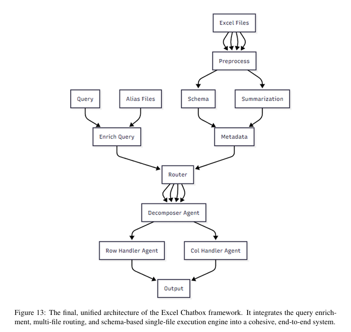

# Core Processing Engine

This directory contains the core logic for the Excel Chatbot backend. It is a self-contained, schema-driven processing engine responsible for interpreting complex Excel files, understanding natural language queries, and retrieving the precise data requested by the user.

The entire architecture is built on a foundational **security-first principle**: the sensitive data within the Excel files *never* leaves the local environment. All interactions with external Large Language Models (LLMs) are performed using only the file's structural metadata (i.e., the headers and their hierarchical relationships), ensuring enterprise-grade privacy and security.

## Architecture and Data Flow

The core engine operates as a multi-stage pipeline that progressively transforms a user's query into a deterministic data extraction command. This code-independent workflow allows the system to handle any matrix-like Excel file without requiring template-specific code.

The end-to-end process for a single file query is as follows:

1.  **Preprocessing (`preprocess.py`)**: When a file is uploaded, it first undergoes cleaning. Headers are standardized (e.g., "Unnamed: 0" becomes "Header"), and hierarchical row categories are filled in to ensure a clean, consistent DataFrame.
2.  **Schema Extraction (`metadata.py`, `llm.py`)**: Using the preprocessed file, the system extracts the structural schema. An LLM analyzes the header layout to semantically distinguish between **Feature Rows** (vertical, categorical headers) and **Feature Columns** (horizontal, metric-based headers). Then, the full `Row Hierarchy` and `Column Hierarchy` are extracted into a nested dictionary format.
3.  **Query Decomposition (`llm.py`, `prompt.py`)**: The user's query is processed by a chain of LLM-powered "agents":
    *   **Decomposer Agent**: Splits the query into `Row Keywords` and `Column Keywords`.
    *   **Row/Column Handler Agents**: These agents work in parallel. Each receives the keywords for its respective dimension and, using the extracted schema, resolves them into a precise, unambiguous `Row Identifier` and `Col Identifier`.
4.  **Data Extraction (`extract_df.py`)**: The generated Row and Column Identifiers are used to perform a deterministic slice on the in-memory pandas DataFrame. This step retrieves the exact subset of data requested by the user.
5.  **Post-processing (`postprocess.py`)**: The final DataFrame subset is converted into a frontend-ready JSON format. This module calculates the necessary `rowspan` and `colspan` values for each header cell, allowing the frontend to perfectly reconstruct the visual appearance of the original, complex Excel table.

## Module Breakdown

Each file in this directory has a distinct and specialized responsibility.

### `config.py`

-   **Purpose**: Manages all configuration for the core engine, including API keys, model names, and application settings.
-   **Key Features**:
    -   **LLM Instance Pooling**: A key performance and scalability feature. The application pre-initializes a pool of LLM client instances at startup, one for each available `GOOGLE_API_KEY`.
    -   **Thread-Safe Access**: Access to the LLM pool is managed via a thread-safe, round-robin mechanism (`get_next_llm_instance`), ensuring efficient and safe resource sharing in a concurrent web server environment.
    -   **Centralized Settings**: Defines application-wide constants like `UPLOAD_FOLDER` and `ALLOWED_ORIGINS`, making configuration easy to manage.

### `processor.py`

-   **Purpose**: The central orchestrator of the entire system. This module contains the `MultiFileProcessor` class which wires all other modules together to execute the full processing pipeline.
-   **Key Features**:
    -   **State Management**: Uses a `FileMetadata` class to neatly store all extracted information (DataFrame, schema, summary, etc.) for each processed file.
    -   **Multi-File Routing (RAG)**: Implements a sophisticated Retrieval-Augmented Generation pattern. It uses an LLM-powered **Summarization Agent** to create a "semantic fingerprint" of each file. A **Routing Agent** then uses these summaries to intelligently decompose a user's query and assign the relevant parts to the correct file(s).
    -   **Alias Integration**: Before processing, it enriches the user's query using the `AliasEnricher` to improve the accuracy of the downstream agents.

### `llm.py`

-   **Purpose**: Manages all direct interactions with the Large Language Model. It encapsulates prompt construction and the parsing of LLM responses.
-   **Key Features**:
    -   **Multi-Agent System**: Implements the query decomposition logic through the `splitter` function, which coordinates the Decomposer, Row Handler, and Column Handler agents.
    -   **LLM-Powered Schema Analysis**: Uses the LLM to perform the initial, critical task of identifying the semantic `feature_rows` and `feature_cols` from the file's header structure.
    -   **Response Parsers**: Contains dedicated functions (`parse_decomposer_output`, etc.) to reliably parse the structured text output from the LLM, making the system resilient to minor variations in the LLM's response.

### `prompt.py`

-   **Purpose**: A centralized repository for all prompt templates used in the application. This is the heart of the "software" that directs the LLM's reasoning process.
-   **Key Features**:
    -   **Few-Shot Prompts**: The prompts are engineered with multiple, detailed examples of inputs and desired outputs. This guides the LLM to produce structured, reliable responses.
    -   **Chain-of-Thought Design**: The prompts are designed to work together as a multi-step reasoning chain (Decompose -> Handle Row/Col), which dramatically improves accuracy over a single, monolithic prompt.
    -   **Clarity and Specificity**: The instructions in the prompts are extremely detailed, defining the expected format and handling edge cases, which is crucial for getting predictable, machine-parsable output from the LLM.

### `preprocess.py`

-   **Purpose**: Cleans and prepares the raw Excel data for reliable processing.
-   **Key Features**:
    -   `extract_headers_only`: A token-saving optimization that sends only the header structure to the LLM for schema analysis, not the entire file.
    -   `clean_unnamed_header`: Standardizes pandas' default `Unnamed: ...` column names for merged cells into a consistent `"Header"` placeholder, which is used later in post-processing.
    -   `forward_fill_column_nans`: Intelligently fills in hierarchical category labels to ensure every row has a complete context.

### `metadata.py`

-   **Purpose**: Responsible for extracting the hierarchical structure from a DataFrame.
-   **Key Features**:
    -   **Recursive Hierarchy Conversion**: Employs sophisticated recursive functions (`convert_df_rows_to_nested_dict`, `convert_df_headers_to_nested_dict`) to transform the flat DataFrame structure into a nested dictionary that accurately represents the file's visual hierarchy.
    -   **Intelligent Pruning**: The conversion logic is designed to clean the resulting hierarchy by removing redundant or meaningless branches (e.g., empty "Undefined" categories).

### `extract_df.py`

-   **Purpose**: Translates the LLM's conceptual output into concrete `pandas` filtering operations.
-   **Key Features**:
    -   **Custom Parsers**: Contains parsers (`parse_row_paths`, `parse_col_paths`) that read the specific indented-text format generated by the Handler agents.
    -   **Dynamic Query Construction**: Programmatically builds complex boolean filtering masks for `pandas` based on the parsed paths, correctly combining multiple criteria with AND/OR logic.

### `postprocess.py`

-   **Purpose**: Transforms the final filtered data into a rich, frontend-ready JSON format.
-   **Key Features**:
    -   **`header_matrix` Generation**: The highlight of this module. It algorithmically calculates the correct `rowspan` and `colspan` for every header cell, enabling a perfect, high-fidelity reconstruction of the original Excel file's merged-cell layout in the frontend.
    -   **Acronym-Based Flattening**: Provides a "flattened" version of the headers for simpler visualization, using a clever acronym generator (`create_acronym`) to keep the resulting labels concise and readable.

### `alias_handler.py`

-   **Purpose**: Manages query enrichment using a user-provided alias dictionary.
-   **Key Features**:
    -   **Enrich, Don't Replace**: The core principle. Instead of replacing an alias (e.g., "CP") with its full term ("Chi phí"), it augments the query to `CP(Chi phí)`. This is more robust because it allows matching on either the alias or the full term, depending on what's in the file.
    -   **Caching**: Caches the loaded alias dictionary in memory to avoid repeated file I/O for a globally shared resource.

### `utils.py`

-   **Purpose**: A collection of helper functions used across the core modules.
-   **Key Features**:
    -   **Fuzzy Matching**: Uses the `thefuzz` library to find the best match between feature names extracted by the LLM and the actual column names in the file, making the system resilient to minor typos.
    -   **LLM-Specific Formatters**: Contains functions (`format_row_dict_for_llm`, `format_col_dict_for_llm`) that format the internal schema representation into the specific textual format that the LLM prompts expect.
